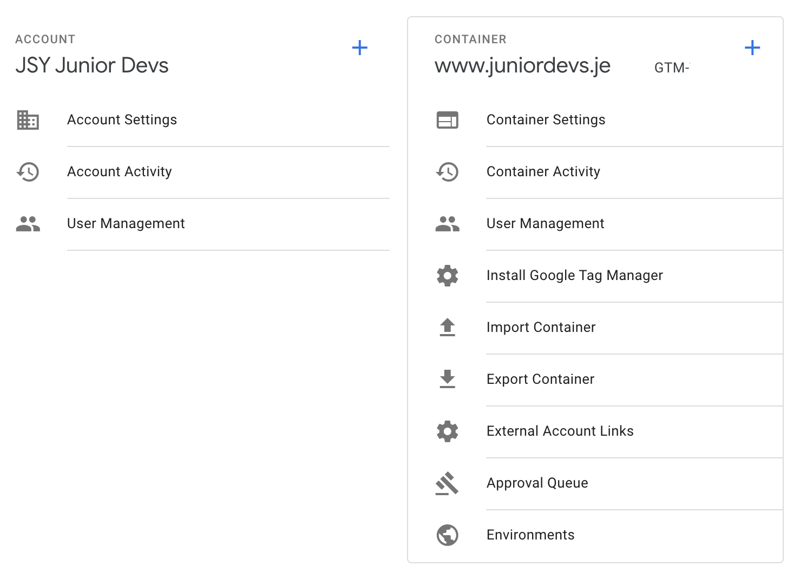
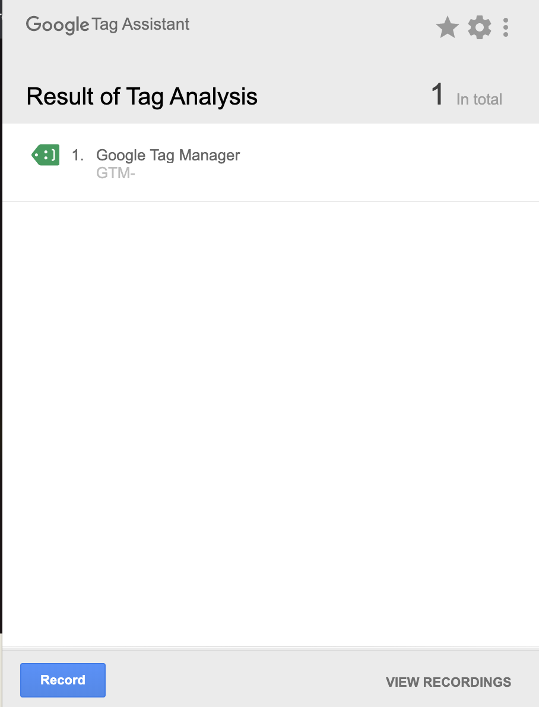
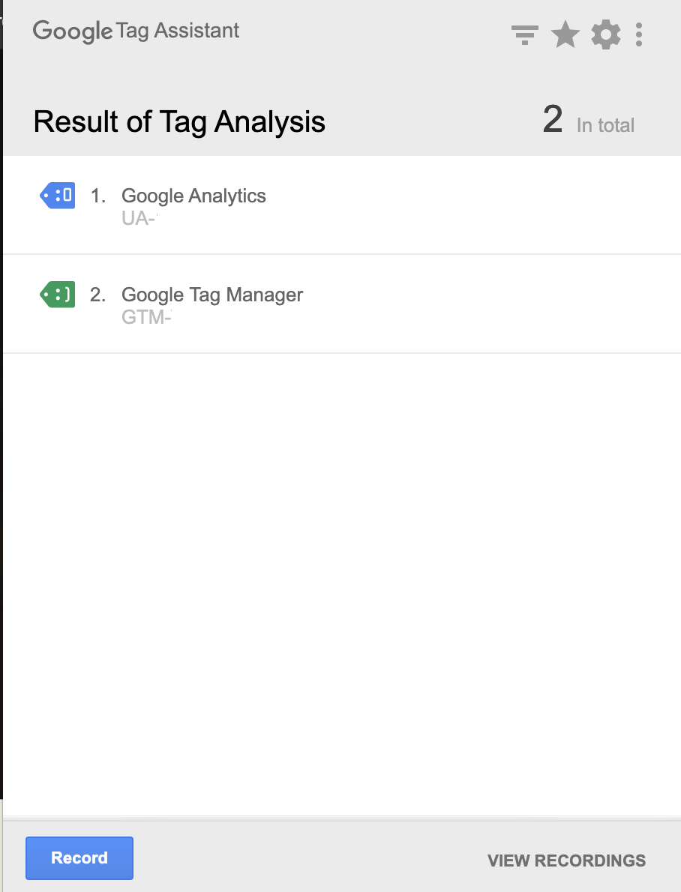

I have been recently working on a collaborative project to build a community website. This has been built in react and is the first real time I have worked on an actual live site using [React](https://reactjs.org/).

I always aim to implement Google Analytics (GA) via Google Tag Manager (GTM) as it takes the one hit to implement GTM on the site then it allows your marketing team the flexibility to further add to the container over time without taking up developer time. Whilst just adding GTM to a site is easy (and therefore easy to get wrong with regards to integrity of the data) I found myself in the common situation where I did not want to be firing GA requests (and distorting data) whilst multiple people contributed to the react site & tested their development versions.

This post documents how I managed to firstly implement GTM in a react app, in a reliable and simple way, and how to differentiate between development & production so only the production site was firing GA requests (i.e. the live site recording actual visits). The concepts in this post can be used for a plethora of other scenarios and you can further add some oomph to your analytics game by combining these techniques with GA filters and properly managed GTM triggers (both of those warrant posts of their own!).

Whilst this post focuses on React the same principles are transferrable to other fremworks i.e Flask, Django, Wordpress!

### Prerequisites:

1. A Google Analytics (GA) account for your site
2. A Google Tag Manager (GTM) container (this will then contain the google analytics tag and is what gets implemented on your react site)
3. Install the [Tag Assistant Chrome extension](https://chrome.google.com/webstore/detail/tag-assistant-by-google/kejbdjndbnbjgmefkgdddjlbokphdefk?hl=en) which helps debug GA & GTM implementations
4. The React part of this assumes you have used [Create React App](https://create-react-app.dev/)

Once the above are set up you need someway of adding GTM to your React app. From doing some searching [npm-gtm-module](https://www.npmjs.com/package/react-gtm-module) seems great and is tried and tested. We will cover installation and set up below.

## Google Tag Manager Environments

GTM allows you to have multiple environments and then choose which environment has which version of your GTM container. This allows you to finely control what tags and set up you have across live and production.

To create you development environment go to your Google Tag Manager account and got to **Admin > Environments:**



You should already have a Live & Latest environment which are created as default. Click New and create an environment called Dev. Give it a description and optionally fill in the URL.

Once you have you 2 environments set up you can click on actions (next to each environment) and 'get snippet'. This will open a modal that has the GTM code for your site, for that environment. If you are doing a vanilla implementation directly in to your site then you would copy and paste the relevant snippet for the relevant version of your site however chances are you are using `react-gtm-module` so you need the following from the snippet (data in red):
```javascript
    <!-- Google Tag Manager -->
    <script>(function(w,d,s,l,i){w[l]=w[l]||[];w[l].push({'gtm.start':
    new Date().getTime(),event:'gtm.js'});var f=d.getElementsByTagName(s)[0],
    j=d.createElement(s),dl=l!='dataLayer'?'&l='+l:'';j.async=true;j.src=
    'https://www.googletagmanager.com/gtm.js?id='+i+dl+ '&gtm_auth=wOLlB9ZmTeQvnptGPP4WAA&gtm_preview=env-7&gtm_cookies_win=x';f.parentNode.insertBefore(j,f);
    })(window,document,'script','dataLayer','GTM-000000');</script>
    <!-- End Google Tag Manager -->
```
The 2 values you need from each environment snippet are:

- `gtm_auth` - in the react GTM module this is auth
- `gtm_preview` - this is called preview in the react GTM module

For all environments the GTM ID will be the same as this identifies your GTM account

With your 2 environments set up you can now choose which environment you want to publish your container changes to and can have different versions for each environment. So you may choose to have a container that has no analytics tag for dev but have GA in your live environment meaning only your production site will record any GA hits.

## Setting Up Google Tag Manager in your React App

In your react app's folder firstly install [react-gtm-module](https://www.npmjs.com/package/react-gtm-module) in the terminal:

    npm i react-gtm-module --save

This will install the module and add to your `package.json` as a dependencies (**NB:** `—save` is assumed in later versions of npm so may not be needed but better to be safe than sorry)

Once you have the GTM side of things taken care & installed the module head over to your entry point in your react app (typically `index.js` within your app's `src` folder) and add the following code:
```javascript
    // import the GTM Module so you can access it
    import TagManager from "react-gtm-module";
    
    //identify if you are on development or production
    //when you build your app process.env.NODE_ENV is set to 'production' 
    const env = process.env.NODE_ENV; 
    
    const tagManagerArgs = {
      gtmId: "<your GTM ID>",
      //the below changes GTM values based on whether dev or production
      auth: env === "development"
          ? "<dev ga_auth>"
          : "<live ga_auth>",
      preview: env === "development"
        ? "<dev ga_env>"
        : "<live ga_env>"
    };
```
To test it is working run `npm start` and open the Tag Assistant extension in Chrome. INspect to see that the GTM tag is properly implemented and (in my testing case) the GA tag is not being loaded:



Example of Tag Assistant on the Dev Environment

Then build your app and then re-run the same test this time checking that GTM tag **and** the GA tag is loading:



Tag Assistant on production showing both GTM & GA being loaded correctly

From the above Tag Assistant screenshots you can see that the development site is just loading the GTM tag and the live site is loading both the GTM tag and the GA tag. This is because the GTM version used for development has the GA tag paused as I do not want to fire hits to GA when contributors are testing during development.